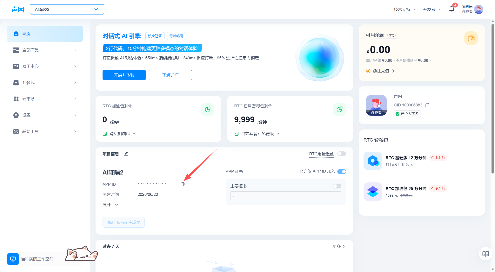

# 𝔸 ℕ𝕚𝕤𝕖 ℝ𝕖𝕕𝕦𝕔𝕥𝕚𝕠𝕟 v{{VERSION}}

🎉 **AI Noise Reduction v{{VERSION}} 正式发布！**

Windows 平台实时 AI 音频降噪工具，采集麦克风音频，通过声网（Agora）AI 降噪引擎处理后输出到虚拟声卡，供任何应用（腾讯会议、浏览器、游戏等）使用。

---

## 📥 下载

| 文件 | 说明 |
|------|------|
| `AINoiseReduction-{{VERSION}}-win-x64.exe` | 安装包（推荐） |

运行安装程序后将自动：
- ✅ 安装主应用
- ✅ 检测并安装 .NET Desktop Runtime 10.0（如缺失）
- ✅ 检测 VB-CABLE 虚拟声卡并引导安装（如缺失）
- ✅ 创建桌面快捷方式和开始菜单

---

## 🔑 获取声网 AppID

本软件依赖声网（Shengwang）AI 降噪引擎，首次使用需要配置 AppID。步骤如下：

1. 打开 **[声网控制台](https://console.shengwang.cn)**，没有账号请先注册
2. 登录后点击左侧 **项目管理** → **创建项目**
3. 项目类型选择 **通用项目**，项目名称随意填写
4. 创建成功后，复制 **AppID**
5. 启动本软件，验证 AppID 即可（只需验证一次）

声网免费账户每月赠送 **10,000 分钟** 时长，对个人降噪使用完全足够。

> 💡 `console.shengwang.cn` 创建的项目在国内网络环境下可用。`console.agora.io`（国际站）创建的项目未在本软件中验证。
