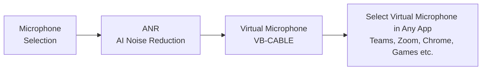

# AI Audio Noise Reduction

**English** · [简体中文](./README.zh-CN.md)

<p align="center">
  <strong>Real-time AI-powered audio noise suppression for Windows.</strong><br/>
  Capture microphone audio, apply deep learning denoising via Agora SDK, and output clean audio through a virtual audio device — ready for any application.
</p>

<p align="center">
  
  
  
</p>

<p align="center">
  <a href="https://github.com/withoutcat/AI-Audio-Noise-Reduction/releases"></a>
</p>

---

## 🚀 Quick Start

1. Download the latest installer from [Releases](https://github.com/withoutcat/AI-Audio-Noise-Reduction/releases)
2. Run the installer (VB-CABLE and .NET Runtime will be installed automatically if missing)
3. Launch the app, select your microphone, choose a denoising mode, and click **Start**
4. In any other application (Teams, Zoom, browser, etc.), select **CABLE Output** as your microphone

That's it! Your voice is now crystal clear.

---

## ✨ Features

- **Real-time AI Denoising** — Sub-100ms latency using Agora's AI Noise Suppression
- **3 Denoising Modes** — Balanced / Aggressive / Ultra-low-latency
- **Hot-switch** — Change microphone or denoising mode while running
- **Smart Setup** — Installer auto-detects and installs VB-CABLE and .NET Runtime
- **AppID Management** — Verify and persist Agora AppID via dialog
- **Default Mic Switching** — Optionally set CABLE Output as system default on start, restore on stop
- **Persistence** — Remembers last device, mode, and AppID
- **Compact UI** — Borderless window with custom title bar
- **Single Instance** — Mutex-protected against duplicate launches
- **Debug Mode** — Toggle to see detailed technical logs

---

## 🏗️ How It Works



| Stage | Detail |
|-------|--------|
| **Capture** | Select any physical microphone from the UI |
| **Denoising** | Agora AI Noise Suppression (3 modes) |
| **Conversion** | 16kHz mono → 48kHz stereo via sample repetition |
| **Output** | Writes to VB-CABLE Input → CABLE Output becomes a clean "microphone" |

---

## 📦 Installation

### Using the Installer (Recommended)

Download `AI_Noise_Reduction_Setup_1.0.0.exe` from [Releases](https://github.com/withoutcat/AI-Audio-Noise-Reduction/releases) and run it.

The installer will:
- ✅ Install the main application
- ✅ Check for and install .NET Desktop Runtime 10.0 if needed
- ✅ Check for VB-CABLE and guide you to install it if needed
- ✅ Create desktop shortcut and Start Menu entry

### Prerequisites

- **Windows 10 / 11** (x64)
- **[VB-CABLE Virtual Audio Device](https://vb-audio.com/Cable/)** (free) — installed automatically by the installer
- **[Shengwang (Agora) AppID](https://console.shengwang.cn/)** — Free tier: 10,000 minutes/month

---

## ⚙️ Configuration

Settings are stored in `config.json` next to the executable:

```json
{
  "AppId": "your_agora_app_id",
  "LastCaptureDeviceName": "Microphone (Realtek Audio)",
  "LastAinsMode": 0,
  "DebugMode": false,
  "VirtualMicphoneName": "CABLE Output"
}
```

---

## 🛠️ Build from Source

<details>
<summary>Click to expand build instructions</summary>

### Prerequisites

- [.NET 10 SDK](https://dotnet.microsoft.com/en-us/download/dotnet/10.0)
- Visual Studio 2022+ with **Desktop development with C++** workload

### Build Steps

```powershell
# 1. Clone the repository
git clone https://github.com/withoutcat/AI-Audio-Noise-Reduction.git
cd AI-Audio-Noise-Reduction

# 2. Build the native Bridge DLL
cd src\NoiseReduction.Bridge
.\build.bat
cd ..\..

# 3. Build and run the .NET app
dotnet run --project src\NoiseReduction.App
```

> **Note**: The Bridge DLL depends on the Shengwang Native SDK (`res/sdk/`), which is vendored in this repo.

### Build Installer

```powershell
.\build-installer.ps1
```

Output: `installer\output\AI_Noise_Reduction_Setup_1.0.0.exe`

</details>

---

## 📁 Project Structure

```
src/
├── NoiseReduction.Core/              # Interfaces & abstractions
│   ├── Audio/                        #   AudioFrame, AudioFormatSpec
│   ├── Devices/                      #   IAudioDeviceManager, AudioDeviceInfo
│   ├── Logging/                      #   AppLogger (thread-safe)
│   └── Pipeline/                     #   IAudioPipelineSession
├── NoiseReduction.Infrastructure/    # Implementations
│   ├── Devices/                      #   NaudioDeviceManager
│   └── Pipeline/                     #   AgoraAinsPipelineSession (core)
├── NoiseReduction.App/               # WPF UI (MVVM)
│   ├── Services/                     #   AppConfig, AudioDeviceUtility, UiHelper
│   ├── ViewModels/                   #   MainViewModel, RelayCommand
│   └── Views/                        #   AppIdDialog
└── NoiseReduction.Bridge/            # C++ → Agora SDK bridge (DLL)
```

---

## 🗺️ Roadmap

- [x] Core AI denoising pipeline
- [x] AppID management & verification
- [x] Hot-switch microphone / denoising mode
- [x] Single instance, borderless window, drag support
- [x] Default mic auto-switch (via COM PolicyConfig)
- [x] Installer package (bundles VB-CABLE driver detection)
- [ ] Custom virtual device naming
- [ ] Device name customization UI

---

## 🙏 Acknowledgments

- [Agora / Shengwang RTC SDK](https://docs.agora.io/en/) — AI Noise Suppression engine
- [NAudio](https://github.com/naudio/NAudio) — Audio device enumeration & playback
- [VB-CABLE](https://vb-audio.com/Cable/) — Virtual audio driver

---

## 📄 License

This project is licensed under the MIT License.
