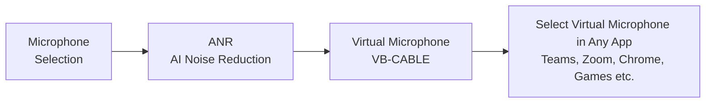
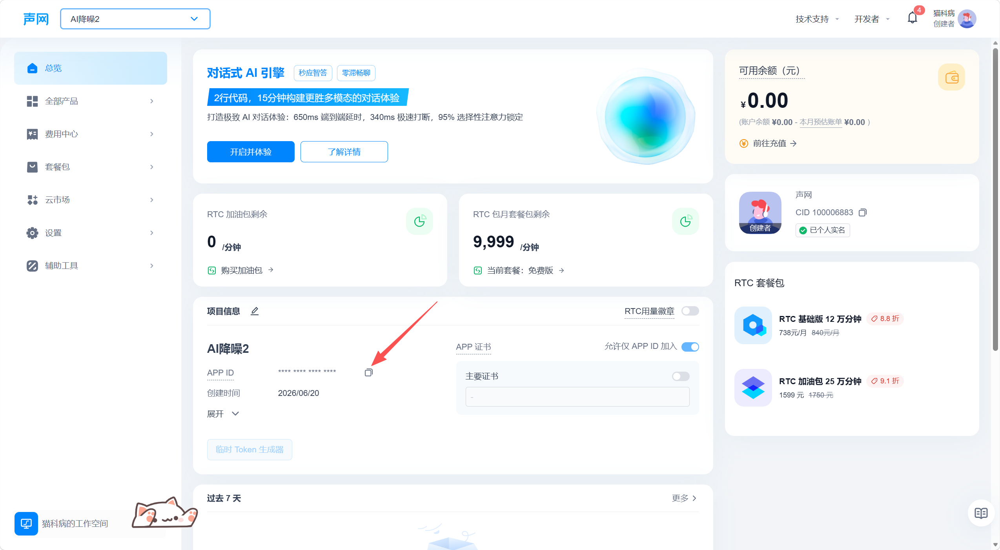

# 𝔸𝕀 ℕ𝕠𝕚𝕤𝕖 𝕊𝕦𝕡𝕡𝕣𝕖𝕤𝕤𝕚𝕠𝕟

**English** · [简体中文](./README.zh-CN.md)

<p align="center">
  <strong>Real-time AI-powered audio noise suppression for Windows.</strong><br/>
  Capture microphone audio, apply deep learning denoising via Agora SDK, and output clean audio through a virtual audio device — ready for any application.
</p>

<p align="center">
  
  
  
</p>

<p align="center">
  <a href="https://github.com/withoutcat/AI-Audio-Noise-Reduction/releases"></a>
</p>

---

## 🚀 Quick Start

1. Download the latest installer from [Releases](https://github.com/withoutcat/AI-Audio-Noise-Reduction/releases)
2. Run the installer (VB-CABLE and .NET Runtime will be installed automatically if missing)
3. Launch the app, select your microphone, choose a denoising mode, and click **Start**
4. In any other application (Teams, Zoom, browser, etc.), select **CABLE Output** as your microphone

That's it! Your voice is now crystal clear.

---

## ✨ Features

- **Real-time AI Denoising** — Sub-100ms latency using Agora's AI Noise Suppression
- **3 Denoising Modes** — Balanced / Aggressive / Ultra-low-latency
- **Hot-switch** — Change microphone or denoising mode while running
- **Smart Setup** — Installer auto-detects and installs VB-CABLE and .NET Runtime
- **AppID Management** — Verify and persist Agora AppID via dialog
- **Auto-Switch Mic** — Optionally switch the system default microphone to CABLE Output on start, restore it on stop
- **Persistence** — Remembers last device, mode, AppID, and settings
- **Compact UI** — Borderless window with custom title bar
- **Single Instance** — Mutex-protected against duplicate launches
- **Debug Mode** — Toggle to see detailed technical logs

---

## 🏗️ How It Works


```mermaid
graph LR
    A[Microphone<br/>Selection]
    --> C[ANR<br/>AI Noise Reduction]
    C --> D[Virtual Microphone<br/>VB-CABLE]
    D --> E[Select Virtual Microphone in Any App<br/>Teams, Zoom, Chrome, Games etc.]
```

| Stage | Detail |
|-------|--------|
| **Capture** | Select any physical microphone from the UI |
| **Denoising** | Agora AI Noise Suppression (3 modes) |
| **Conversion** | SDK outputs 48kHz stereo PCM directly; no conversion needed |
| **Output** | Writes to VB-CABLE Input → CABLE Output becomes a clean "microphone" |

---

## 📦 Installation

### Using the Installer (Recommended)

Download `AINoiseReduction-{{VERSION}}-win-x64.exe` from [Releases](https://github.com/withoutcat/AI-Audio-Noise-Reduction/releases) and run it.

The installer will:
- ✅ Install the main application
- ✅ Check for and install .NET Desktop Runtime 10.0 if needed
- ✅ Check for VB-CABLE and guide you to install it if needed
- ✅ Create desktop shortcut and Start Menu entry

### Prerequisites

- **Windows 10 / 11** (x64)
- **[VB-CABLE Virtual Audio Device](https://vb-audio.com/Cable/)** (free) — installed automatically by the installer
- **[Shengwang (Agora) AppID](https://console.shengwang.cn/)** — Free tier: 10,000 minutes/month

### 🔑 Get a Shengwang AppID

This app uses Shengwang (Agora) AI noise suppression engine. You need an AppID for first-time setup:

1. Open **[Shengwang Console](https://console.shengwang.cn)** and sign up if you don't have an account
2. Click **项目管理** (Project Management) → **创建项目** (Create Project)
3. Select **通用项目** (General Project), name it whatever you like
4. After creation, copy the **AppID**



5. Launch the app, verify your AppID (one-time only)

The free tier includes **10,000 minutes/month**, more than enough for personal noise reduction.

> 💡 Projects created on `console.shengwang.cn` work within China's network. Projects from `console.agora.io` (international) have not been tested.

---

## ⚙️ Configuration

Settings are stored in `%LOCALAPPDATA%\AINoiseReduction\config.json`:

```json
{
  "AppId": "your_agora_app_id",
  "LastUserMicphoneID": "{0.0.1.00000000}.{xxxxxxxx-xxxx-xxxx-xxxx-xxxxxxxxxxxx}",
  "LastAinsMode": 0,
  "DebugMode": false,
  "AutoSwitchMic": true,
  "DefaultVirtualMicphoneID": "{0.0.1.00000000}.{xxxxxxxx-xxxx-xxxx-xxxx-xxxxxxxxxxxx}"
}
```

`DefaultVirtualMicphoneID` is written by the installer when VB-CABLE is detected, and the app also saves it after the first successful start.

---

## 🛠️ Build from Source

<details>
<summary>Click to expand build instructions</summary>

### Prerequisites

- [.NET 10 SDK](https://dotnet.microsoft.com/en-us/download/dotnet/10.0)
- Visual Studio 2022+ with **Desktop development with C++** workload

### Build Steps

```powershell
# 1. Clone the repository
git clone https://github.com/withoutcat/AI-Audio-Noise-Reduction.git
cd AI-Audio-Noise-Reduction

# 2. Build the native Bridge DLL
cd src\NoiseReduction.Bridge
.\build.bat
cd ..\..

# 3. Build and run the .NET app
dotnet run --project src\NoiseReduction.App
```

> **Note**: The Bridge DLL depends on the Shengwang Native SDK (`res/sdk/`), which is vendored in this repo.

### Build Installer

```powershell
# Default: auto-detect version from git tag, Release configuration
.\build-installer.ps1

# Override version
.\build-installer.ps1 -AppVersion "1.3.0"

# Debug build, skip Bridge build
.\build-installer.ps1 -Configuration Debug -SkipBridge

# Skip dotnet publish (use existing build output)
.\build-installer.ps1 -SkipPublish

# Full control
.\build-installer.ps1 -AppVersion "1.3.0" -Configuration Debug -SkipBridge -SkipPublish
```

| Parameter       | Type     | Default    | Description |
|----------------|----------|------------|-------------|
| `-AppVersion` | string   | *(git tag)* | Override the version string (e.g. `"1.3.0"`). Falls back to latest git tag, then `0.0.0`. |
| `-Configuration` | string | `Release`   | Build configuration: `Debug` or `Release`. |
| `-SkipBridge` | switch   | off        | Skip building the C++ Bridge DLL. Use if the DLL already exists. |
| `-SkipPublish` | switch   | off        | Skip the `dotnet publish` step. Use if the app was already published. |

Output: `installer\output\AINoiseReduction-{version}-win-x64.exe`

</details>

---

## 📁 Project Structure

```
src/
├── NoiseReduction.Core/              # Interfaces & abstractions
│   ├── Audio/                        #   AudioFrame, AudioFormatSpec
│   ├── Devices/                      #   IAudioDeviceManager, AudioDeviceInfo
│   ├── Logging/                      #   AppLogger (thread-safe)
│   └── Pipeline/                     #   IAudioPipelineSession
├── NoiseReduction.Infrastructure/    # Implementations
│   ├── Devices/                      #   NaudioDeviceManager
│   └── Pipeline/                     #   AgoraAinsPipelineSession (core)
├── NoiseReduction.App/               # WPF UI (MVVM)
│   ├── App.xaml(.cs)                 #   Single instance, tray icon, window lifecycle
│   ├── MainWindow.xaml(.cs)          #   Main window
│   ├── MiniBarWindow.xaml(.cs)       #   Mini bar window
│   ├── Services/                     #   AppConfig, AppUpdaterService, AudioDeviceSwitcher, AudioDeviceUtility, UiHelper
│   ├── ViewModels/                   #   MainViewModel, RelayCommand
│   └── Views/                        #   AppIdDialog
└── NoiseReduction.Bridge/            # C++ → Agora SDK bridge (DLL)
```

---

## 🙏 Acknowledgments

- [Agora / Shengwang RTC SDK](https://docs.agora.io/en/) — AI Noise Suppression engine
- [NAudio](https://github.com/naudio/NAudio) — Audio device enumeration & playback
- [VB-CABLE](https://vb-audio.com/Cable/) — Virtual audio driver

---

## 📄 License

This project is licensed under the MIT License.
